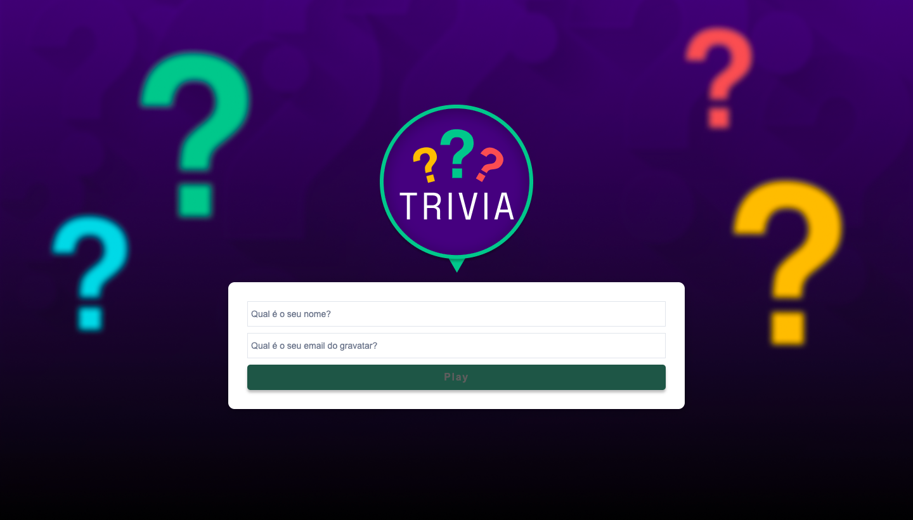
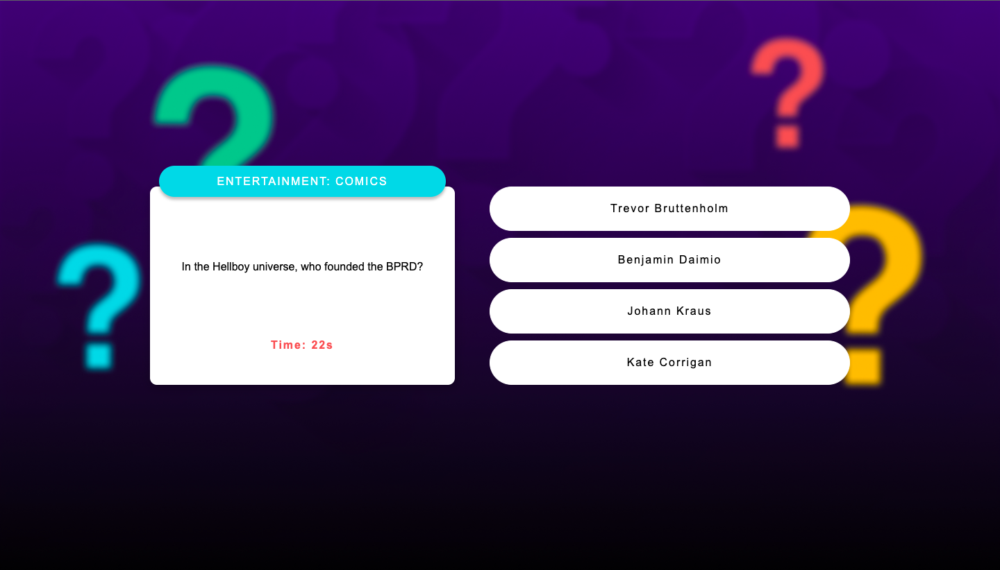

# Trivia
Trivia is a question and answer game developed using react and redux, in a team with the support of a kanban board. This application is capable of:

- Log in to the game and, if the email is registered on the Gravatar website, have your photo associated with the user's profile;
- Access the page referring to the game, where you must choose one of the available answers for each of the questions presented. The answer must be marked before the time counter reaches zero, otherwise the answer is considered wrong;
- Be redirected, after 5 answered questions, to the score screen, where the text shown depends on the number of correct answers;
- View the ranking page, if you like, at the end of each game;
- To set up some options for the game in a settings screen accessible from the app's header.

<div align="center" display="inline">




</div>

## How to use:
- First clone the repository into your machine;

```
 git clone git@github.com:GabiNamu/trybewallet.git
```
- After cloning, enter into the repository and install the dependencies;

```
npm install
```
- Then to see in your browser, you just need to do a npm start;
```
npm start
```
## Main technologies used:
- React;
- React Router;
- API request;
- JavaScript;
- Redux;
- Css;

## Contributors:
This project was made with a team: 
 - Michelle Marquez;
 - Arthur Mucci;
 - Ricardo Pereira;
 - Vinicius Pozzatto;
 - George Henrique.
